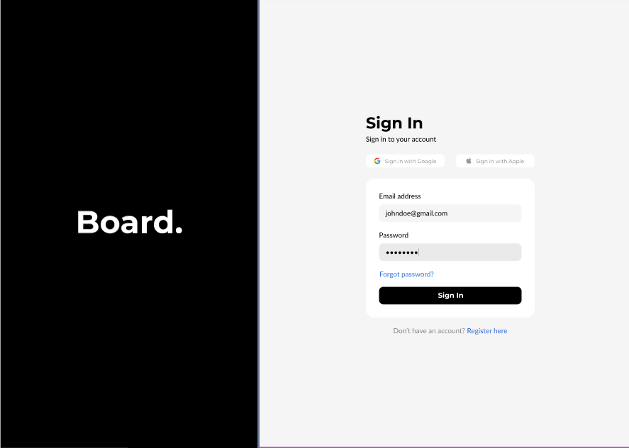

# Project Dashboard Readme


## Overview

This repository contains the code for a project dashboard built using React and CSS for styling, with a Node.js backend. The dashboard provides a user-friendly interface to visualize and manage project-related data.

## Features

- **Data Visualization:** The dashboard offers intuitive visualizations to represent project statistics, progress, and other key metrics.

- **Responsive Design:** The UI is designed to adapt seamlessly to various screen sizes, ensuring a consistent experience across devices.

- **Node.js Backend:** The backend, built on Node.js, handles data retrieval, storage, and API communication.

- **Interactive Elements:** Users can interact with the dashboard through various elements such as charts, graphs, and filters.

## Installation

1.a Clone the repository:


1.b **Navigate to the project directory in your terminal:**

   
    cd project-dashboard
  

2. **Install dependencies for the backend (Node.js, Express, CORS):**

    ```sh
    cd backend
    npm init -y
    npm install nodemon express cors
    ```

3. **Start the backend server (Node.js):**

    ```sh
    npm start
    ```

4. **In a separate terminal, navigate to the frontend directory (React):**

    ```sh
    cd frontend
    ```

5. **Install dependencies for the frontend (Axios for API calls):**

    ```sh
    npm install axios
    ```

6. **Start the frontend development server (React):**

    ```sh
    npm start
    ```

7. **Open your web browser and go to [http://localhost:3000](http://localhost:3000) to access the dashboard (React UI).**

## Screenshots


*Screenshot 1: Overview of project statistics.*


*Screenshot 2: Detailed view of project progress.*

## Contributing

Contributions are welcome! If you'd like to contribute to the project, please follow these steps:

1. Fork the repository.
2. Create a new branch: `git checkout -b feature-new-feature`
3. Make your changes and commit them: `git commit -m 'Add new feature'`
4. Push to the branch: `git push origin feature-new-feature`
5. Submit a pull request detailing your changes.


